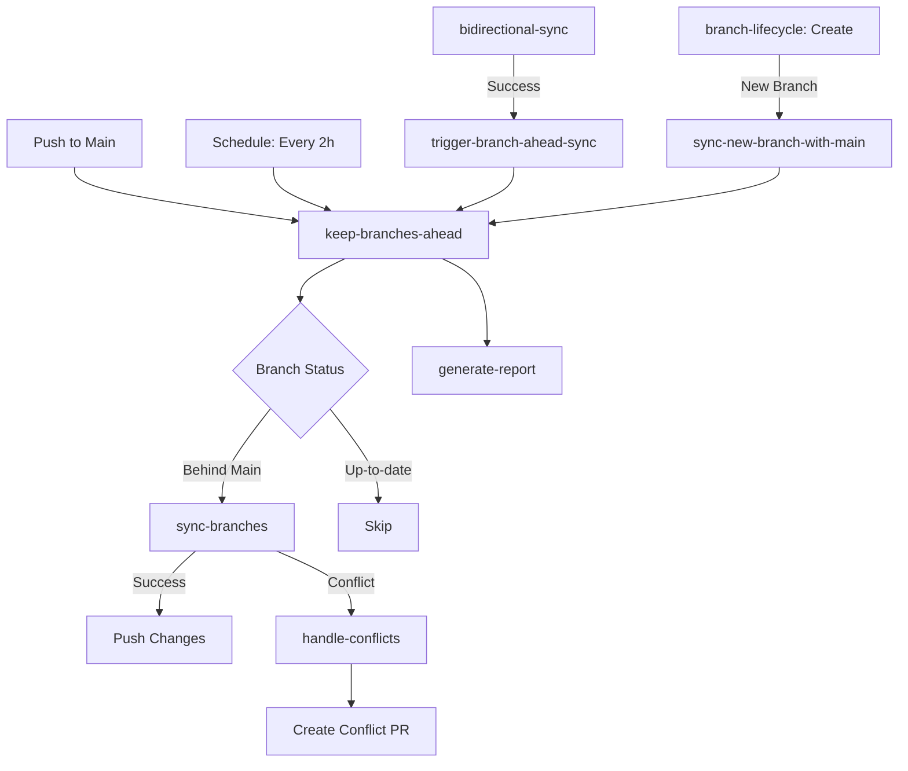

# GitHub Workflows Documentation

## Overview

This directory contains GitHub Actions workflows that automate branch synchronization, lifecycle management, and ecosystem coordination for the HSOMNI9000 FruitfulPlanet ecosystem.

## 🔄 Enhanced Branch Synchronization System

The Enhanced Branch Synchronization System ensures all active branches in the repository stay ahead of `main` at all times with automatic merging and intelligent conflict resolution.

### Key Workflows

#### 1. Keep Branches Ahead (`keep-branches-ahead.yml`)

**Purpose:** Automatically merges `main` into all active feature branches to keep them ahead of the main branch.

**Triggers:**
- **Schedule:** Every 2 hours (`0 */2 * * *`)
- **Push to main:** Immediate sync when main branch is updated
- **Repository dispatch:** Triggered by other workflows (bidirectional-sync, branch-lifecycle)
- **Manual:** Via workflow_dispatch with optional branch filtering

**Features:**
- ✅ Auto-detects all active branches matching configured patterns
- ✅ Checks which branches are behind main
- ✅ Merges main into feature branches using `--no-ff` strategy
- ✅ Auto-resolves conflicts in lock files and generated files
- ✅ Creates conflict resolution PRs for complex conflicts
- ✅ Generates detailed sync reports with statistics
- ✅ Parallel processing (max 5 concurrent syncs)

**Configuration:**
```yaml
# Branch patterns to sync
BRANCH_PATTERNS: 'copilot/* claude/* feature/* fix/* hotfix/* develop'

# Branches to exclude
EXCLUDE_BRANCHES: 'main gh-pages production'

# Auto-merge enabled
AUTO_MERGE_ENABLED: true

# Create conflict PRs
CONFLICT_PR_ENABLED: true

# Maximum parallel syncs
MAX_PARALLEL_SYNCS: 5
```

**Workflow Jobs:**

1. **detect-branches** - Scans repository for branches matching configured patterns
2. **check-branch-status** - Determines which branches are behind main
3. **sync-branches** - Merges main into branches (matrix strategy, max-parallel: 5)
4. **handle-conflicts** - Creates conflict-resolution PRs for failed merges
5. **generate-report** - Creates artifacts with sync results and statistics

**Manual Trigger:**

```bash
# Sync all branches
gh workflow run keep-branches-ahead.yml

# Sync specific pattern
gh workflow run keep-branches-ahead.yml -f branch_filter="copilot/*"

# Force sync even if up-to-date
gh workflow run keep-branches-ahead.yml -f force_sync=true
```

---

#### 2. Bidirectional Sync (`bidirectional-sync.yml`)

**Purpose:** Syncs changes bidirectionally between FruitfulPlanet and upstream repositories (CodeNest, OmniGrid).

**Integration with Keep-Branches-Ahead:**
- After successful sync from CodeNest or OmniGrid, automatically triggers keep-branches-ahead workflow
- Ensures synced branches immediately get latest updates from main
- Uses `repository_dispatch` event type `trigger_branch_sync`

**New Job Added:**
```yaml
trigger-branch-ahead-sync:
  name: 🚀 Trigger Keep-Branches-Ahead Sync
  needs: [sync-from-codenest, sync-from-omnigrid]
  if: always() && (needs.sync-from-codenest.result == 'success' || needs.sync-from-omnigrid.result == 'success')
```

---

#### 3. Branch Lifecycle (`branch-lifecycle.yml`)

**Purpose:** Automates branch creation, mirroring, and cleanup across ecosystem repositories.

**Integration with Keep-Branches-Ahead:**
- When a new branch is created, triggers keep-branches-ahead sync for that specific branch
- Ensures new branches are immediately synced with latest main
- Coordinates with mirror branch creation

**New Step Added:**
```yaml
- name: Sync new branch with main
  if: steps.config.outputs.auto_create == 'true'
  # Triggers keep-branches-ahead for newly created branch
```

---

### 📋 Configuration Files

#### sync-config.yml

Centralized configuration for all sync behaviors:

```yaml
sync:
  branch_patterns:
    - 'copilot/*'
    - 'claude/*'
    - 'feature/*'
    - 'fix/*'
    - 'hotfix/*'
    - 'develop'
  
  exclude_branches:
    - 'main'
    - 'gh-pages'
    - 'production'
  
  auto_merge:
    enabled: true
    strategy: 'merge'
    create_conflict_pr: true
    preserve_history: true
  
  conflict_resolution:
    auto_resolve_patterns:
      - 'package-lock.json'
      - 'pnpm-lock.yaml'
      - 'yarn.lock'
      - '*.lock'
    strategy: 'theirs'
```

#### ecosystem-config.json

Ecosystem-wide configuration for repository relationships and sync strategies.

---

## 🔀 Conflict Resolution

### Automatic Resolution

The system automatically resolves conflicts in:
- **Lock files:** package-lock.json, pnpm-lock.yaml, yarn.lock, Cargo.lock, etc.
- **Strategy:** Uses `--theirs` to accept the version from main for these files
- **Commit:** Automatically commits resolved conflicts

### Manual Resolution

When automatic resolution isn't possible:

1. **Conflict PR Created:**
   - Title: `🔀 Resolve merge conflict: [branch-name] ← main`
   - Labels: `conflict-resolution`, `automated-sync`, `needs-review`
   - Detailed body with resolution steps

2. **Resolution Steps:**
   ```bash
   # Fetch the conflict resolution branch
   git fetch origin sync/conflict-resolution/[branch-name]-[timestamp]
   git checkout sync/conflict-resolution/[branch-name]-[timestamp]
   
   # Merge main and resolve conflicts
   git merge origin/main
   # Resolve conflicts in your editor
   git add .
   git commit -m "chore: resolve merge conflicts from main"
   
   # Push changes
   git push origin sync/conflict-resolution/[branch-name]-[timestamp]
   ```

3. **Merge PR:** Once conflicts are resolved, merge the PR to update the original branch

---

## 🎯 Workflow Interactions



---

## 📊 Reports and Artifacts

### Sync Reports

Generated after each keep-branches-ahead run:

**Location:** Artifacts → `keep-branches-ahead-report-[run-id]`

**Contents:**
- `keep-branches-ahead-[timestamp].json` - Detailed sync report
- `summary.txt` - Human-readable summary

**Report Structure:**
```json
{
  "timestamp": "2024-01-04T17:00:00Z",
  "workflow_run_id": "12345",
  "trigger": "schedule",
  "detection": {
    "total_branches_detected": 5,
    "branches_detected": ["copilot/feature-1", "claude/feature-2", ...]
  },
  "status_check": {
    "branches_needing_sync": 3,
    "branches_to_sync": ["copilot/feature-1", ...]
  },
  "sync_results": {
    "sync_job_status": "success",
    "conflict_handler_status": "skipped"
  }
}
```

---

## 🚀 Branch Naming Conventions

### Recommended Patterns

Follow these patterns for automatic sync:

- **Copilot branches:** `copilot/[feature-name]`
- **Claude branches:** `claude/[feature-name]`
- **Feature branches:** `feature/[feature-name]`
- **Fix branches:** `fix/[issue-description]`
- **Hotfix branches:** `hotfix/[critical-fix]`
- **Development branch:** `develop`

### Protected Branches

These branches are **excluded** from automatic sync:
- `main` - Primary production branch
- `gh-pages` - GitHub Pages deployment
- `production` - Production deployment branch

---

## 🛠️ Troubleshooting

### Branch Not Syncing

**Issue:** Branch not being synced with main

**Solutions:**
1. Check if branch matches configured patterns in `sync-config.yml`
2. Verify branch is not in exclude list
3. Check workflow logs for errors
4. Manually trigger: `gh workflow run keep-branches-ahead.yml -f branch_filter="your-branch"`

### Conflict PR Not Created

**Issue:** Merge conflict detected but no PR created

**Solutions:**
1. Check GitHub token permissions (`ECOSYSTEM_SYNC_TOKEN` or `GITHUB_TOKEN`)
2. Verify workflow has permission to create PRs
3. Check workflow logs for API errors
4. Ensure `CONFLICT_PR_ENABLED=true` in workflow env

### Sync Taking Too Long

**Issue:** Sync jobs timing out or taking excessive time

**Solutions:**
1. Reduce `MAX_PARALLEL_SYNCS` in workflow env
2. Use branch filtering to sync specific patterns
3. Check for large binary files causing slow merges
4. Consider increasing timeout in workflow

### Auto-Resolution Failing

**Issue:** Lock files not being auto-resolved

**Solutions:**
1. Verify file patterns in `sync-config.yml` → `conflict_resolution.auto_resolve_patterns`
2. Check if files are actually lock files
3. Review workflow logs for resolution attempts
4. May need manual resolution for complex lock file conflicts

---

## 🔐 Security Considerations

### Tokens

- **ECOSYSTEM_SYNC_TOKEN:** Recommended - GitHub PAT with repo scope
- **GITHUB_TOKEN:** Fallback - Auto-generated token with limited permissions

### Permissions Required

- `contents: write` - Push changes to branches
- `pull-requests: write` - Create conflict resolution PRs
- `actions: write` - Trigger workflows via repository_dispatch

### Branch Protection

Compatible with branch protection rules:
- Sync respects protected branches
- Conflict PRs can go through required reviews
- Status checks apply to conflict resolution branches

---

## 📈 Monitoring

### GitHub Actions Summary

Each workflow run provides a summary:

```
🔄 Keep Branches Ahead - Sync Summary

Workflow Run: #12345
Triggered by: schedule
Timestamp: 2024-01-04T17:00:00Z

📊 Results

| Metric | Value |
|--------|-------|
| 🔍 Branches Detected | 5 |
| ⬆️ Branches Behind Main | 3 |
| ✅ Sync Status | success |
| 🔀 Conflict Handler | skipped |
```

### Artifacts

Check artifacts for detailed reports:
1. Go to workflow run
2. Scroll to "Artifacts" section
3. Download `keep-branches-ahead-report-[run-id]`

---

## 🔧 Advanced Configuration

### Custom Branch Patterns

Edit `.github/sync-config.yml`:

```yaml
sync:
  branch_patterns:
    - 'copilot/*'
    - 'claude/*'
    - 'team-a/*'
    - 'team-b/*'
    - 'experiment/*'
```

### Schedule Adjustment

Edit `.github/workflows/keep-branches-ahead.yml`:

```yaml
on:
  schedule:
    - cron: '0 */1 * * *'  # Every hour instead of every 2 hours
```

### Parallel Execution

Adjust in workflow env:

```yaml
env:
  MAX_PARALLEL_SYNCS: 10  # Increase from 5 to 10
```

### Disable Auto-Merge

```yaml
env:
  AUTO_MERGE_ENABLED: false  # Disable automatic merging
```

---

## 📞 Support

For issues or questions:
1. Check workflow logs in GitHub Actions
2. Review artifacts for detailed reports
3. Check existing issues in repository
4. Create new issue with workflow run ID

---

## 🤖 Ecosystem Integration

Part of the **HSOMNI9000 FruitfulPlanet Ecosystem**:
- **FruitfulPlanetChange** - Primary hub
- **CodeNest** - Meta-aggregator (80+ repos)
- **OmniGrid** - Infrastructure backbone

All workflows coordinate to maintain synchronization across the ecosystem while keeping individual branches ahead of their respective main branches.

---

**Last Updated:** 2024-01-04  
**System:** HSOMNI9000 Enhanced Branch Synchronization  
**Version:** 1.0
